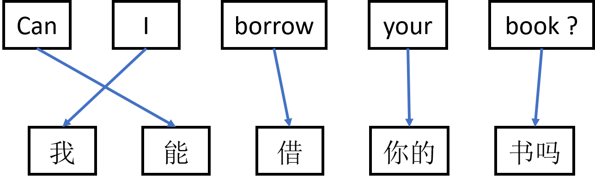

Recently, I have learnt something about machine translation and done a presentation about it. Why not transform the slides into my first post? This post contains some personal understandings of some popular models like, Google's Neural Machine Translation System [[Wu et al.]](https://arxiv.org/abs/1609.08144), Attention is all you need [[Vaswani et al.]](https://arxiv.org/abs/1706.03762) and so on, and if there is any misunderstandings, please correct me in the comment.

## What is machine translation?
Machine translation is a very straight forward term, that is to let the program do translation work automatically, translating a sentence from one language to another. The following is an example translating a sentence in English to Chinese.

{: .center-image}

More formally speaking, the goal of the machine translation task is actually **maximize the probability of the target sentence $Y$ given the source sentence $X$**, that is maximizing $P(Y|X)$. 
### Objective function
Before we talk about the objective function of the task, we can take a closer look at the goal. By applying Bayes' theorem to the probability $P(Y|X)$, we can have that 
$\text{maximize } P(Y|X) $ $= \prod_{i=0}^n P(Y_i | X, Y_0, \cdots, Y_{i-1}).$ 
And the actual meaning of each term is that the probability of the $i^{th}$ phrase in target sentence given the source sentence $X$ and the prefix of this phrase. In the figure below, $P(Y_2 | X, Y_0, Y_1)$, for example, is the probability of "借" given "Can I borrow your book?", "我" and "能".

{: .center-image}
{:height="30%" width="30%"}

As a common trick, we can take logarithm of the production and get the objective function of the task, that is 
$$\text{maximize} \sum_{i=0}^n \log P(Y_i | X, Y_0, \cdots, Y_{i-1}).$$
This objective function is equivalent to the original goal, but we can benefit a lot from it when designing a algorithm to achieve the goal.

Instead of designing a translator that generate the whole target sentence all at once (this may be quite hard as the length of the target sentence varies for different inputs), with the summation of log probabilities in mind, the translator can **predict the probability for one phrase at a time** given the source sentence and the prefix of this phrase. By running the translator several times, each time have one more phrase in the prefix, the translator can generate the target sentence.

{:.center-image}

## Time for methods!
There are several methods that are designed to achieve the goal we mentioned before, including *statistical*, *sequence to sequence*, *transformer*, etc.
### Statistical - Phrase-Based Translation
The statistical method is the conventional way to do the translation task. And the one used in [[1]](#Reference) is called phrase-based translation.

The main idea of this method is that when the program takes a foreign input, it will firstly cut the input into phrases and then **translate these phrases one by one independently**. Finally, the program will **reorder the translated phrases** to make the target sentence more natural.

And the goal of this method is to $\text{maximize } P(Y|X)$ by maximizing $P(X|Y)\cdot P_{LM}(Y)$, where $P_{LM}$ is a language model that measures the order of the predicted sentence, by evaluating each trigram in the sentence. There are some elegant and mathematical way to design the translation model and the language model, but I am not going to discuss them here.

### Sequence to Sequence - GNMT
For a more advance model for machine translation, Google published a model called Google's Neural Machine Translation System [[2]](#Reference), or for short GNMT. And the figure below shows the architecture of it.

{:.image-caption}
Figure Credit: [Wu et al.], Google's Neural Machine Translation System [[2]](#Reference)

The GNMT uses a lot of Long Short Term Memory networks (LSTMs) stacked together, all of the layers are one-directional LSTM except the one at the input, which is a bidirectional LSTM. The model can be divided into three parts, including an encoder, a decoder and an attention part in the middle. The figure below is a simplified GNMT model.

In this example, for the model, a source sentence, "Can I borrow your book?", is given, the encoder will take the sequence of word embedding representing the source sentence. By the way, *word embedding* is a kind of vectors in a quite low dimension  space (much smaller than the vocabulary space) that can represent words. When the encoder gets the embedding sequence, it outputs a sequence of hidden vectors with the same length as the input sentence. In expectation, these hidden vectors should contains the information of the phrases in the source sentence as well as the information of the whole sequence.

To make it clear, the training and testing process of GNMT is to optimize the objective function we mentioned before -- $\text{maximize } \sum_{i=0}^n P(Y_i|X, Y_0, \cdots, Y_{i-1})$. GNMT predicts a phrase in the target sentence one by one. And each time, the decoder will be fed with the prefix of the phrase we want to predict. 

Getting the hidden vectors, the attention part use the information of the prefix, and generate a sequence of weights for the hidden sequence. Taking the **weighted average** of the hidden vectors, the attention part outputs a embedding vector that contains the all the information from the source sentence. In the meantime, the information in the embedding vector is ***focused on* predicting the next phrase** after the prefix because of the weight applied to the hidden vectors.

Finally, the LSTMs in the decoder uses the word embedding sequence of the prefix and the embedding vector $e_3$ and outputs the probability distribution for the next phrase on the vocabulary. The model then can calculate the objective function by adding up these log probabilities. 

The training process takes the gradient of the objective function and updates the parameters in the model. The testing process, however, the model will use **beam search** (with the probability of each phrase given the source sentence and the prefix in hand, the beam search can be done easily) for generating target sentence. 

## Transformer - Attention is All You Need
The state-of-the-art machine translation model is designed by another group at Google, which is usually called Transformer. The figure below shows the architecture of the transformer model.

{:.image-caption}
Figure Credit: [Vaswani et al.], Attention is All You Need [[3]](#Reference)

The main difference between the transformer and the GNMT is that the LSTM layers in the GNMT are replaced by **attentions and feed-forward networks** (or linear networks). Without those recurrent networks, the transformer model does not suffer the long dependency problem (causing the gradients to explode or vanish) many recurrent networks have.

Another difference is that in the GNMT model, it only has one attention part, i.e. the hidden vectors are only used once in generating the embedding with focused information; on the other hand, in the transformer model, the attention that extracts information from the hidden vectors is **included in the basic block of the decoder**. Therefore, if the decoder has multiple basic blocks, it can extract more information from the hidden vectors, and adapt those information to focus on the next phrase.

As for the training and testing processes of this model, they are almost the same as the GNMT model. The model uses the probabilities it generates **for each phrase** in the target to compute the objective function and update the parameters in the networks. Also, by applying beam search, the model can generate the target sentence while testing.

It is good to mention that there some tricks for accelerating the training process of neural machine translation models, like GNMT and Transformer. To having batches of sentences that have different lengths, we can use mask to indicate that which parts of a input batch are paddings. Also, in order to train the model for each phrase in the target (of length $k$), we do not need to run the model for $k$ times with different prefix, but by right shift the target sentence that is fed into the decoder and applying mask of size $k\times k$, to the attention, all of the probabilities of the phrases in target sentence can be generated in one step.

## Summary
In this post, I mentioned my understanding of some models used for machine translation, including the conventional methods, the sequence to sequence neural methods and the state-of-the-art transformer methods. There are also many other excellent models for translation task. For example, the convolutional sequence to sequence model, [[4]](#Reference), uses the convolution networks instead of the recurrent network used in GNMT. Each of these models are designed carefully to solve the translation problem in natural language processing. With so many brilliant ideas to appreciate, it is very interesting exploring such fields.

## Reference
[1] [Statistical Phrase-Based Translation](http://www.aclweb.org/anthology/N03-1017), Philipp Koehn, Franz Josef Och, Daniel Marcu. Presentations at DARPA IAO Machine Translation Workshop, 2002

[2] [Google’s Neural Machine Translation System: Bridging the Gap between Human and Machine Translation](https://arxiv.org/abs/1609.08144), Yonghui Wu, Mike Schuster, Zhifeng Chen, Quoc V. Le, Mohammad Norouzi, Wolfgang Macherey, Maxim Krikun, Yuan Cao, Qin Gao, Klaus Macherey, Jeff Klingner, Apurva Shah, Melvin Johnson, Xiaobing Liu, Łukasz Kaiser, Stephan Gouws, Yoshikiyo Kato, Taku Kudo, Hideto Kazawa, Keith Stevens, George Kurian, Nishant Patil, Wei Wang, Cliff Young, Jason Smith, Jason Riesa, Alex Rudnick, Oriol Vinyals, Greg Corrado, Macduff Hughes, Jeffrey Dean. Technical Report, 2016.

[3] [Attention is All You Need](https://arxiv.org/abs/1706.03762), Ashish Vaswani, Noam Shazeer, Niki Parmar, Jakob Uszkoreit, Llion Jones, Aidan N. Gomez, Lukasz Kaiser, Illia Polosukhin. NeurIPS 2017.

[4] [Convolutional Sequence to Sequence Learning](https://arxiv.org/abs/1705.03122),Jonas Gehring, Michael Auli, David Grangier, Denis Yarats, Yann N. Dauphin. NeurIPS 2017.

